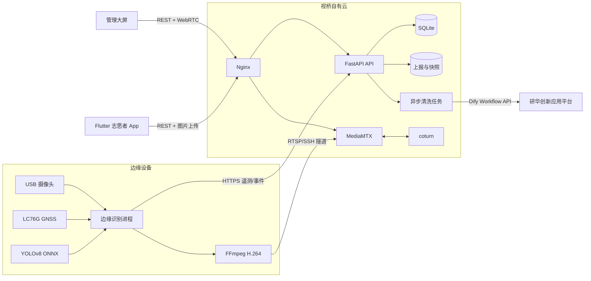

# VisionBridge / 视桥

> 面向城市盲道与无障碍通行场景的边缘 AI、实时地图与志愿者协同平台。

视桥将摄像头、GNSS、边缘推理、自有云、低延迟视频和公众协作串成一条闭环：边缘设备在本地识别盲道占用并直传自有云；管理员审核事件并发布公共任务；志愿者通过 Flutter App 拍照上报、地图接单、现场处理和提交复核证据。

本仓库是研华 AIoT 创新应用大赛项目的可复现工程版本。当前属于可运行原型，已经完成单边缘设备、单云节点和志愿者闭环验证，不应直接视为具备高可用、合规审计和大规模并发能力的生产系统。

| 管理大屏 | 边缘识别 |
| --- | --- |
|  |  |

## 项目解决什么问题

传统无障碍设施巡检依赖人工发现、线下流转和重复沟通，障碍位置、现场证据、处置责任和复核结果难以形成统一数据。视桥围绕“发现、审核、派单、处置、复核”建立可追踪状态流，并坚持两条技术边界：

- 识别在边缘设备本地完成，原始画面不上传第三方 AI 平台；
- 遥测、事件、图片和视频直接进入自有云，不经研华 IoTSuite 转发；研华托管 Dify 仅异步返回数据清洗建议，不成为业务事实源。

研华 IoTSuite 的早期适配代码已退出主运行链路，迁移背景见 [历史兼容说明](docs/legacy/advantech-iotsuite.md)。

## 已实现能力

| 模块 | 当前能力 | 主要技术 |
| --- | --- | --- |
| 边缘端 | USB 摄像头采集、LC76G GNSS、YOLOv8 ONNX 推理、N-of-M 时间窗确认、周期证据、稳定清除、离线重试 | Python、OpenCV DNN、ONNX |
| 自有云 API | 邮箱验证码、原始数据留存、质量检查、时空去重、研华托管 Dify 异步分析、审核与派单闭环 | FastAPI、SQLite |
| 管理大屏 | 事件地图、审核与派单、设备健康、多设备入口、WebRTC/HLS 播放 | React、TypeScript、Vinext |
| 志愿者 App | QQ 邮箱验证码、拍照上报、系统定位、地图选点、地图接单、任务处理、个人记录删除 | Flutter、WebView、高德地图 JS API |
| 媒体链路 | 边缘硬件编码、RTSP 发布、WebRTC/WHEP 低延迟播放、HLS 回退、TURN 中继 | FFmpeg、MediaMTX、coturn |
| 数据同步 | 业务变更触发 WebSocket 通知，客户端重取 REST 权威快照，断线低频轮询兜底 | WebSocket + REST |

尚未完成的生产化工作包括 PostgreSQL 迁移、对象存储、消息队列、多实例协调、完整管理员 RBAC、端到端可观测性、隐私合规流程和规模化压力测试。

## 系统架构



核心数据来源和接口边界：

| 数据 | 来源 | 进入云端的方式 | 使用方 |
| --- | --- | --- | --- |
| 摄像头帧 | USB 摄像头 | 本地推理；标注视频经 RTSP 发布 | 边缘识别、管理大屏 |
| 经纬度 | LC76G GNSS 或手机系统定位 | 遥测 JSON / App 表单 | 地图、事件、任务 |
| 识别事件 | 边缘端状态机 | `POST /api/v1/telemetry` + Bearer Token | 事件地图、设备健康 |
| 志愿者上报 | App 相机、文字与地图选点 | multipart HTTP | 管理审核、公共地图 |
| 实时视频 | 边缘端 FFmpeg | MediaMTX RTSP，浏览器 WHEP/WebRTC | 设备详情 |
| 邮箱验证码 | 自有云 SMTP 客户端 | QQ SMTP SSL | 志愿者登录 |
| 清洗建议 | 自有云异步任务 | 研华托管 Dify Workflow API | 质量评分、优先级与人工复核提示 |

完整组件职责、状态机和一致性策略见 [系统架构](docs/ARCHITECTURE.md)，HTTP 接口见 [API 概览](docs/API.md)。

## 仓库结构

```text
visionbridge-aiot-accessibility/
├─ .github/                 # CI、Issue/PR 模板、依赖更新配置
├─ apps/
│  ├─ dashboard/            # 管理大屏
│  └─ volunteer/            # Flutter Android/Web 客户端
├─ services/
│  └─ api/                  # FastAPI 与 SQLite 业务服务
├─ edge/
│  └─ pi-runtime/           # 边缘识别、GNSS、遥测与视频发布
├─ deploy/                  # Nginx、MediaMTX、coturn、systemd 与发布脚本
└─ docs/                    # 架构、开发、部署、需求和赛事说明
```


## 快速开始

### 环境要求

- Node.js `>=22.13` 与 npm；
- Python `>=3.11`；
- Flutter `3.44.9`，Dart `>=3.2.6 <4.0.0`；
- 边缘端另需 Linux、OpenCV、ONNX Runtime/OpenCV DNN、FFmpeg、串口与摄像头权限。

### 1. 启动 API

```bash
python -m venv .venv
# Windows: .\.venv\Scripts\Activate.ps1
# Linux/macOS: source .venv/bin/activate
pip install -r services/api/requirements.txt
cp apps/dashboard/.env.example .env
uvicorn services.api.app:app --reload --port 8000
```

开发环境可以设置 `VISIONBRIDGE_EMAIL_DEBUG=1`，API 会返回调试验证码。该选项禁止用于公网环境。

### 2. 启动管理大屏

```bash
cd apps/dashboard
npm ci
npm run dev
```

前端开发服务器需要把 `/api` 请求代理到 `http://127.0.0.1:8000`，或使用生产构建由 Nginx 同源托管。

验证生产静态构建时执行 `npm start`。该命令会先重新生成
`static-deploy`，再启动只读静态服务器；正式环境仍由 Nginx 托管该目录。

### 3. 运行志愿者 App

```bash
cd apps/volunteer
flutter pub get
flutter run --dart-define=VISIONBRIDGE_API_BASE=http://127.0.0.1:8000
```

Android 真机不能用电脑的 `127.0.0.1`，应替换为手机可访问的局域网地址或 HTTPS 域名。Web 同源部署使用 `VISIONBRIDGE_API_BASE=same-origin`。

### 4. 部署边缘端

模型权重不存放在 Git 中。先按 [模型说明](edge/pi-runtime/models/README.md) 放置权重，再执行：

```bash
sudo install -d -m 0755 /opt/visionbridge/edge
sudo install -d -m 0750 /etc/visionbridge
sudo cp edge/pi-runtime/visionbridge_edge.env.example /etc/visionbridge/edge.env
sudo chmod 0640 /etc/visionbridge/edge.env
```

填写自有云 URL、设备 ID 和随机上传令牌后，按 [边缘端说明](edge/README.md) 安装 systemd 服务。

更完整的开发联调步骤见 [开发指南](docs/DEVELOPMENT.md)，生产拓扑和端口见 [部署指南](docs/DEPLOYMENT.md)。

## 配置与安全

仓库只保存带无效占位值的 `*.env.example`。以下内容禁止提交：SMTP 授权码、地图 Key/安全密钥、API 签名密钥、设备上传令牌、TURN 密钥、SSH 凭据、数据库、用户图片和生产日志。

生产环境至少需要独立生成：

- `VISIONBRIDGE_AUTH_SECRET`：登录会话签名；
- `VISIONBRIDGE_INGEST_TOKEN`：边缘遥测鉴权；
- `VISIONBRIDGE_MEDIA_PUBLISH_SECRET`：设备媒体发布；
- `VISIONBRIDGE_TURN_SECRET`：TURN REST 鉴权；
- `VISIONBRIDGE_SMTP_AUTH_CODE`：QQ 邮箱 SMTP 授权码。
- `VISIONBRIDGE_ADVANTECH_DIFY_API_KEY`：研华托管 Dify 工作流密钥，只保存在云服务器的 `agent.env`。

凭据若曾出现在提交、Issue、日志、截图或聊天记录中，必须立即吊销并重新生成。安全报告规则见 [SECURITY.md](SECURITY.md)。

## 测试

```bash
# Dashboard
cd apps/dashboard
npm ci
npm run lint
npm test

# API（从仓库根目录运行）
pip install -r services/api/requirements-dev.txt
python -m pytest services/api

# Flutter
cd apps/volunteer
flutter analyze
flutter test

# Python 语法检查
python -m py_compile services/api/app.py services/api/analysis.py edge/pi-runtime/detection_state.py edge/pi-runtime/visionbridge_edge_agent.py
python -m unittest discover -s edge/tests -v
```

CI 会在每次推送和 Pull Request 上执行管理大屏构建测试、API 流程测试、Flutter 静态检查与测试，以及边缘/部署 Python 语法检查。

## 文档导航

- [系统架构与数据流](docs/ARCHITECTURE.md)
- [HTTP API 概览](docs/API.md)
- [开发与本地联调](docs/DEVELOPMENT.md)
- [生产部署与验收](docs/DEPLOYMENT.md)
- [仓库内容与大文件策略](docs/REPOSITORY_POLICY.md)
- [边缘性能与低延迟链路](edge/性能优化与低延迟链路说明_20260803.md)
- [云端需求规格](docs/design/视桥_云端可视化平台_需求规格与接口设计.md)
- [志愿者 App 需求规格](docs/design/视桥_志愿者App_需求规格与接口设计.md)
- [贡献指南](CONTRIBUTING.md)

## 许可与使用

本仓库目前未附加开源许可证。除 GitHub 平台允许的浏览和 Fork 行为外，源代码、模型、文档和视觉素材的复制、修改、分发或商业使用未获授权。若计划正式开源，应由项目所有者明确选择许可证，并分别确认模型训练数据、第三方文档、地图服务和素材的授权边界。

----
